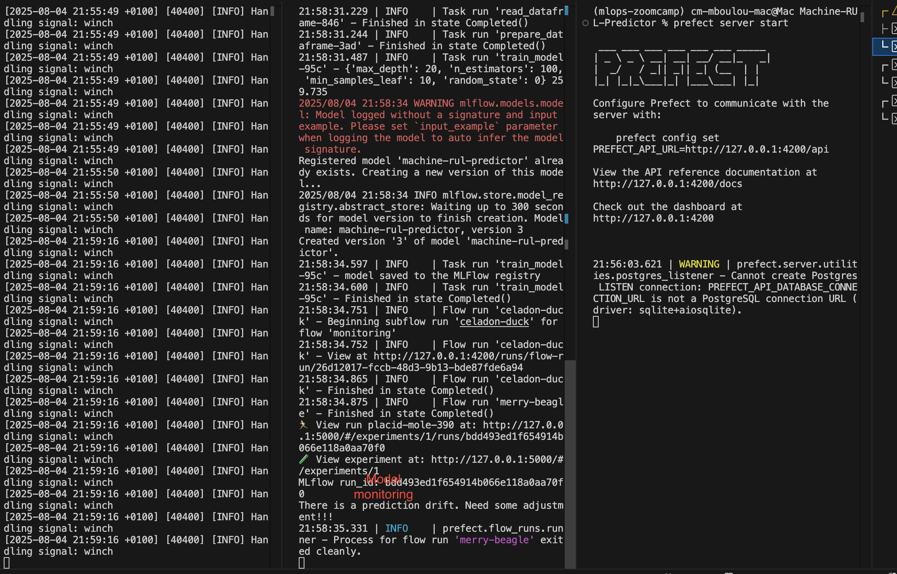

# Plan
- [x] Problem description: The problem is well described and it's clear what the problem the project solves
- [ ] Cloud
- [x] Experiment tracking and model registry
: Both experiment tracking and model registry are used
- [x] Workflow orchestration: Fully deployed workflow orchestration with deployment runs and workpools.
- [ ] Model deployment
- [x] Model monitoring: Comprehensive model monitoring that sends an alert if prediction drift is detected
- [x] Reproducibility: Instructions are clear, it's easy to run the code, and it works. The data is provided and versions for dependencies are specified.
- [ ] Testing the code: unit tests with pytest
- [ ] Integration tests with docker-compose
- [x] Code quality: linting with the VSCode pylint extension and formatting with black and isort
- [x] There is a Makefile
- [ ] Git pre-commit hooks
- [ ] There's a CI/CD pipeline
---

### Environment
First activate the mlops-zoomcamp conda environment that was created for the course:
```sh
conda activate mlops-zoomcamp
```
If you have not create any conda environment, you can create and activate it:
```sh
conda create -n mlops-zoomcamp python=3.9.7
conda activate mlops-zoomcamp
```
You can then install common packages:
```sh
conda install numpy pandas scikit-learn seaborn jupyter
```

You need to install some more dependencies for experiment tracking and workflow orchestration:
```sh
pip install -r env/requirements.txt
```

### End-to-end notebook with experiment tracking and model monitoring
Now use the [capstone project notebook](./capstone_project.ipynb) for building the model, tracking experiments and model monitoring. For completing this notebook successfully, make sure that MLFlow is running locally for experiment tracking:
```sh
mlflow server \
    --backend-store-uri sqlite:///mlflow.db \
    --default-artifact-root ./mlflow-models
```

### Building pipelines
Now we can convert our notebook into a script and make the necessary changes for pipeline orchestration with prefect.

To convert the jupyter notebook into a script:
```sh
jupyter nbconvert --to=script capstone_project.ipynb
```

To rename a script:
```sh
mv capstone_project.py orchestrate_prefect.py
```
Now we will perform some refactoring on the obtained script to get a fully functionning [orchestration pipeline](./orchestrate_prefect.py) for experiment tracking, model management and also for monitoring. Once done we can test it.


### Orchestration pipeline
For running our orchestration pipeline:

- First we run mlflow:
```sh
mlflow server \
    --backend-store-uri sqlite:///mlflow.db \
    --default-artifact-root ./mlflow-models
```
- We launch `Prefect`:
```sh
prefect server start
```
- We configure Prefect locally:
```sh
prefect config set PREFECT_API_URL=http://127.0.0.1:4200/api
```
- We can now run the orchestration script:
```sh
python orchestrate_prefect.py
```
Here is a snapshot:


### For a full deployment of our orchestration file:
We will first do some refactoring and obtain a new [orchestration file](./orchestrate_full_deploy_.py). This refactoring is for making a local deployment. Then:
- First we run mlflow:
```sh
mlflow server \
    --backend-store-uri sqlite:///mlflow.db \
    --default-artifact-root ./mlflow-models
```

- Initialize the prefect project:
```sh
prefect init
```
We choose `local filesystem` for our testing case. This will create essential files:
    - `.prefectignore`: prevents automatic code pushes from Prefect to Git repositories.
    - `prefect.yaml`: the main configuration file for the project and deployment build, pull, and push steps.

- We launch `Prefect`:
```sh
prefect server start
```
- We configurate Prefect locally:
```sh
prefect config set PREFECT_API_URL=http://127.0.0.1:4200/api
```
- We can then start a worker that polls our work pool:
```sh
prefect worker start --pool "capstonepool"
```
- Deployment can be created using the CLI command:
```bash
prefect deploy orchestrate_full_deploy.py:run --name Rul --pool capstonepool
```
Note that:
  - `orchestrate_full_deploy.py:run` specifies the flow entry point.
  - `--name` assigns a deployment name.
  - `--pool` specifies the pool from which workers will pull tasks.

- Run the full deployment:
```sh
prefect deployment run 'run/Rul'
```
We can see the deployement launch:


Here the working pool with monitoring message:


Finally, we can visualize Prefect UI:


### Pipfile environment
For model deployment and best practices a pip environment can be very useful. To install one:
```sh
pipenv install mlflow==2.22.0  scikit-learn==1.5.0  --python=3.9
pipenv install --dev pytest black isort pre-commit
```
### Code Quality
We used the VSCode extension for linting. For code formatting we can use `black`:
```sh
pipenv run black .
```
For sorting imports:
```sh
pipenv run isort .
```

### Git pre-commit
We can now generate a configuration file that will define which hook to run:
```sh
pipenv run pre-commit sample-config > .pre-commit-config.yaml
```
After creating the config file, we create the actual Git hook script in `.git/hooks`:
```sh
pipenv run pre-commit install
```
This will oblige us to make sure the pre-commit hooks are all chcked before pushing the project.

We then make sure to integrate `isort` and `black` in the configuration file with:
```yaml
- repo: https://github.com/pycqa/isort
  rev: 6.0.1
  hooks:
    - id: isort
      name: isort (python)
- repo: https://github.com/psf/black
  rev: 25.1.0
  hooks:
    - id: black
      language_version: python3.9
```

We can now update the project on GIT.

### Refinements
The project was not deployed to the cloud as expected via streaming mode with AWS and Kinesis.

We can work on that...

---
